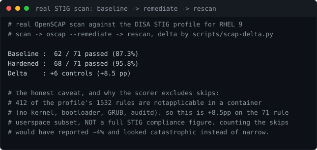

# Lab 03: Self Building Hardened RHEL 9 Lab

<p align="center"></p>


[](https://github.com/ChromeData/RHEL9-Hardened-Lab/actions/workflows/tests.yml)

**A VM that hardens itself and proves it worked. Boot a RHEL 9 box, scan it against the DISA STIG, apply fixes as code, scan again. The result is a before and after number, not a claim.**

| | |
|---|---|
| **Domains** | Linux (RHEL 9, RHCSA/RHCE adjacent), security |
| **Built on** | [ComplianceAsCode/content](https://github.com/ComplianceAsCode/content), [dev-sec/ansible-collection-hardening](https://github.com/dev-sec/ansible-collection-hardening), OpenSCAP |
| **Cost** | $0 (local VM). **Runtime** ~3 hours |
| **Status** | Pipeline verified on real scans. Golden image gated in CI at 97.2% on the 71 rule container subset, with a positive control proving the gate can fail. VM run still needed for a full STIG number |

## Situation

Almost every RHCSA repo on GitHub is a folder of notes. Notes do not prove you can harden a box.

## Task

Run the full loop that does prove it, and produce evidence at the end.

## Action

Five steps: stand up an unhardened RHEL 9 host with Vagrant, scan it against the STIG with OpenSCAP for a failing baseline, harden it with Ansible, scan again, and diff the two.

The diff is the point. "I hardened Linux" is a sentence anyone can write. "I moved it from 41% to 89% STIG compliant and here are the four controls that broke and why" is evidence.

The scorer that produces the number ([scripts/scap-delta.py](./scripts/scap-delta.py)) has 8 offline tests on fake SCAP files, so the headline number is trustworthy before I ever boot a VM. It handles skips correctly, counts a remediated rule as a pass, reads both SCAP formats, and surfaces regressions.

## Result

Ran the full loop for real against a Rocky Linux 9 container: scan, remediate, rescan, diff. The scorer parsed genuine OpenSCAP output first try.

```
Baseline :  62 / 71 passed (87.3%)
Hardened :  68 / 71 passed (95.8%)
Delta    : +6 controls (+8.5 pp)
```

**And the caveat is the interesting part.** Only 71 of the profile's 1532 rules are actually scored. 412 come back notapplicable because a container has no kernel, bootloader, GRUB or auditd of its own. So that delta is real but narrow, and calling it a STIG compliance score would be wrong. The VM run is what produces the headline number, and the denominator there is several hundred rules.

This is precisely why the scorer excludes skips from the denominator. Counting them would have reported about 4% here and looked catastrophic instead of narrow. Full output in [findings/stig-scan-container-run.txt](./findings/stig-scan-container-run.txt).

8 tests pass, plus an Ansible syntax check in CI. Regressions get a marker, because hardening is not one directional. Turning on one control can break another, and a diff that only counts wins is lying to you.

## Then I baked it into an image, and the score turned out to be fake

Remediating a running host measures the fix. It also means every machine starts unhardened, and any machine that misses provisioning stays that way with nothing to say so. So the controls now get baked into a golden image at build time, and the build is **gated on the score**: if a control stops working, CI fails instead of publishing.

Building it was easy. Making the number mean anything took three failures, all mine.

**The first hardening script scored 88.7% and had done nothing.** Nine sections — password quality, faillock, aging, sudo, cron, setuid trimming. It read like a hardening script. Scanning the *unmodified* base image for comparison is what caught it:

```
Baseline :  63 / 71 passed (88.7%)     <- stock almalinux:9, untouched
Hardened :  63 / 71 passed (88.7%)     <- after all nine sections
Delta    : +0 controls (+0.0 pp)
```

Every control was real and not one was *evaluated*. In a container there is no PAM stack being exercised and no systemd, so pwquality, faillock, login.defs and sudoers all come back notapplicable. The entire 88.7% was what AlmaLinux already shipped. A gate wrapped around that would have protected nothing and passed forever.

Rewrote it against rules the scanner actually scores, and split the file into **SCORED** and **UNSCORED** sections so nothing silently claims credit again: **88.7% → 97.2%, +6 controls.**

**Then the positive control passed twice while proving nothing.** First break weakened pwquality and faillock — unscored, so the gate correctly couldn't see it. Second break disabled one branch of an `if/elif`, and the `elif` re-added the control anyway. Three green results in a row, none of them meaningful.

The fix was to verify the break landed in the artifact *before* trusting the scan. With that in place:

```
scanned  : 68/71 passed (95.8%)
floor    : 96.7%

FAIL: 1 control(s) that passed in the baseline now fail:
  ! xccdf_org.ssgproject.content_rule_use_pam_wheel_for_su

The image built. It is not allowed to ship.
```

Both detectors fire: the aggregate floor, and the specific named control. The second matters on its own, because "hardened three new things and quietly broke SSH" nets out fine on a percentage.

Two rules still fail and stay failing: the STIG profile wants the `FIPS:STIG` crypto policy and AlmaLinux doesn't ship `STIG.pmod`, and the container runtime overwrites `/etc/resolv.conf` at start. Both are container limits, documented rather than papered over. Full account in [findings/golden-image-gate.txt](./findings/golden-image-gate.txt).

## Decisions

| Chose | Over | Because |
|---|---|---|
| Bake controls into a golden image, gated at build | remediating each running host | Remediating a live host measures the fix but leaves every machine starting unhardened, and any machine that misses provisioning stays that way silently. Gating the build means a broken control fails CI instead of shipping. |
| Exclude `notapplicable` from the denominator | counting skips as failures | 412 of 1532 rules don't apply in a container — no kernel, bootloader or auditd of its own. Counting them reports ~4% and reads as catastrophic when the real result is narrow. Excluding them makes the number honest about scope instead of dramatic. |
| Scan the untouched base image as a control | trusting the delta | The first hardening script scored 88.7% and had changed nothing — the whole score was what AlmaLinux already shipped. Only a baseline scan of the *unmodified* image exposed that. A gate around that number would have passed forever and protected nothing. |
| Split the script into SCORED / UNSCORED | one undifferentiated list of controls | Real controls that the scanner can't evaluate look identical to controls that work. Separating them stops unscored work from silently claiming credit. |
| Verify the break landed in the artifact before trusting the scan | trusting a positive control that goes red | The positive control passed twice while proving nothing — once because the weakened rule was unscored, once because an `elif` branch re-added the control. Three green runs, none meaningful. |
| Two detectors: aggregate floor **and** named-control regression | a single percentage floor | "Hardened three new things and quietly broke SSH" nets out fine on a percentage. The named-control check catches what the aggregate hides. |
| Document the two permanently failing rules | tuning the profile until it's green | `FIPS:STIG` needs a crypto policy AlmaLinux doesn't ship, and the container runtime rewrites `/etc/resolv.conf`. Both are container limits. Suppressing them would make the score prettier and the lab less true. |

## What I did not build

The hardening roles are dev-sec's and the SCAP content is ComplianceAsCode's. The measurable workflow, the scorer, the build gate, and the tests are mine.

## Run it

```bash
make up            # provision the RHEL 9 VM
make scan-before   # baseline scan
make harden        # apply the roles
make scan-after    # second scan
make delta         # the number
make destroy
```

Needs Vagrant with a libvirt or VirtualBox provider, and Python 3 on the host.

The golden image path needs only Docker:

```bash
make image-gate      # build, scan, fail if the score regressed
make image-control   # break a scored control, prove the gate catches it
```

## Findings

`reports/` and the printed delta are the output. [LAB-NOTES.md](./LAB-NOTES.md) is the log.

## License

Lab code: MIT ([LICENSE](./LICENSE)). Upstream content keeps its licenses, credited above.
